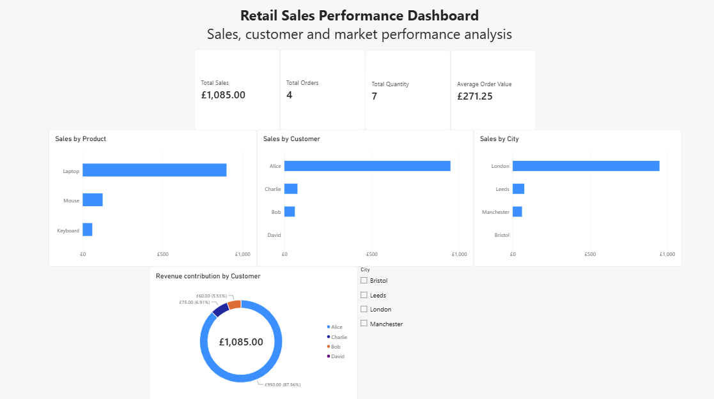

# Retail_Sales_Performance_Analysis

## Business Objectives
This project analyses retail sales performance to identify key revenue contributors, high-value customers, and strong-performing markets. The analysis aims to provide data-driven insights that could support product, customer, and marketing decisions.

## Dataset
The dataset contains three related tables:
- Customers
- Orders
- Products
The analysis combines customer information, order quantities, and product prices to evaluate sales performance.

## Business Questions
1. Which products contribute most to total revenue?
2. Which customers have the highest total spending?
3. What percentage of total revenue does each customer contribute?
4. Which cities generate the highest sales revenue?
5. Are there customers who have not placed an order?

## Tools
- SQL Server
- Power BI
- Python
- Pandas

## SQL Analysis
SQL was used for data extraction and structured analysis, including:
- Aggregations
- INNER JOIN
- LEFT JOIN
- CTEs
- Subqueries
- Window functions
- Ranking
- Revenue contribution analysis

## Key Findings
- Laptop generated the highest revenue at £900, representing approximately 83% of total revenue.
- Alice was the highest-value customer by total spending, generating £950 and contributing approximately 88% of total revenue.
- London generated the highest sales revenue at £950, making it the strongest-performing market in the current dataset.

## Recommendations
- Consider maintaining strong product availability for laptops and exploring targeted marketing opportunities for this product category.
- Consider introducing a loyalty programme for high-value customers based on defined spending criteria.
- Consider further investigating London as a target market and testing targeted local marketing campaigns.

## Python Analysis
Python was used for exploratory data analysis, data validation, and additional analysis of customer, product, and city-level sales performance.

Key analysis included:
- Data preparation and validation
- Product performance analysis
- Customer performance analysis
- City-level sales analysis
- Revenue contribution analysis
- Business insight generation

The full Python analysis and code are available in 'python' folder.

## Power BI Dashboard
Built an interactive dashboard to monitor sales, customer and market performance.

Key features:
- Total Sales, Total Orders, Total Quantity and Average Order Value KPIs
- Sales performance by product, customer and city
- Customer revenue contribution
- City slicer for interactive filtering
 
